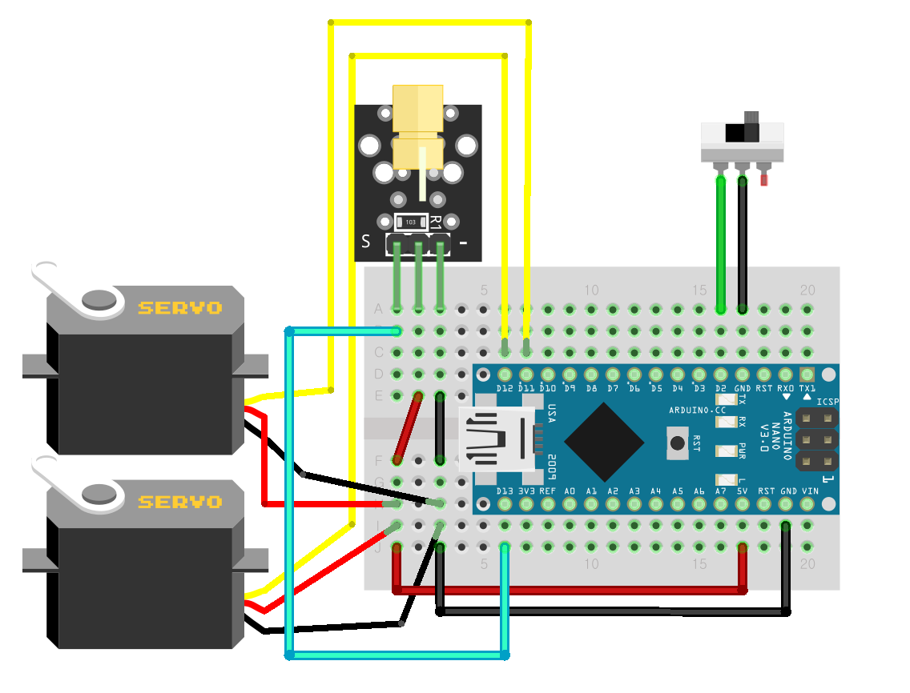

# Gongzipsa 레이저 고양이 장난감 키트 제작
- 스위치 ON 할 시 하단과 상단의 모터가 랜덤한 각도로 움직이며 상단 모터의 끝부분에 레이저가 부착되어 있습니다.

## 사용 부품
- 아두이노 나노
- 서보모터 SG90 2개
- 슬라이드 버튼 1개
- 레이저 모듈 1개

## 라이브러리
- Servo.h

## 연결
|아두이노 나노|서보 모터 1|서보 모터 2|레이저 모듈|슬라이드 버튼|
|--|--|--|--|--|
|5V|+|+|+||
|GND|-|-|-|가운데 다리(COM)|
|D2||||양쪽 다리 중 아무데나|
|D11|S||||
|D12||S|||
|D13|||S||

### 연결 이미지

## 제품 사진
- 추후 추가 예정